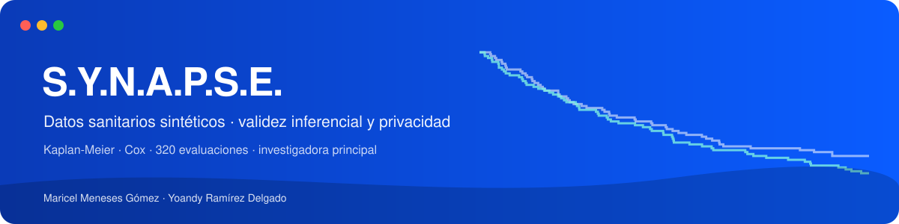

<a href="https://maricelmeneses.github.io/maricelmeneses/">
  <picture>
    <source media="(prefers-color-scheme: dark)" srcset="perfil/assets/banner-dark.svg">
    <source media="(prefers-color-scheme: light)" srcset="perfil/assets/banner-light.svg">
    
  </picture>
</a>

 

&nbsp;

&nbsp;

&nbsp;

---

## `$ whoami`

Licenciada en **Ciencias de la Computación** y **máster en Computación Aplicada**, con **10 años de docencia universitaria** en Computación y Estadística; los últimos cinco, en la **Universidad de Ciencias Médicas de Villa Clara**, con estudiantes de ciencias de la salud.

Hoy aplico ese rigor al **análisis de datos y la bioestadística**: elegir el modelo adecuado, desconfiar de las conclusiones fáciles y traducir resultados técnicos en decisiones claras. Me interesan especialmente el **análisis de supervivencia**, los **datos del mundo real (RWD)** y los **datos sanitarios sintéticos**.

📍 Lepe, Huelva &nbsp;·&nbsp; Disponible para trabajo presencial, híbrido o remoto en análisis de datos, investigación, formación u operaciones.

<b>🇬🇧 Read in English</b>

 

BSc in **Computer Science** and **MSc in Applied Computing**, with **10 years of university teaching** in Computing and Statistics, the last five at the **University of Medical Sciences of Villa Clara**, with health-science students.

I now bring that rigour to **data analysis and biostatistics**: choosing the right model, distrusting easy conclusions and turning technical results into clear decisions. I am especially interested in **survival analysis**, **real-world data (RWD)** and **synthetic health data**.

📍 Lepe, Huelva, Spain &nbsp;·&nbsp; Open to on-site, hybrid or remote roles in data analysis, research, training or operations.

---

## `$ ls proyectos/`

<a href="https://github.com/maricelmeneses/synapse">
  <picture>
    <source media="(prefers-color-scheme: dark)" srcset="perfil/assets/card-synapse-dark.svg">
    
  </picture>
</a>

**[S.Y.N.A.P.S.E.](https://github.com/maricelmeneses/synapse)** · *investigadora principal* · ¿Se puede compartir un ensayo clínico sin compartir a sus pacientes? Estudio de simulación sobre 4 estudios clínicos reales (320 evaluaciones) que mide si los datos sintéticos conservan las conclusiones de Kaplan-Meier y Cox, y si un atacante puede reidentificar a los pacientes. Con [Yoandy Ramírez Delgado](https://github.com/heindall92). &nbsp;[**Abrir el explorador web →**](https://maricelmeneses.github.io/synapse/)

> **En preparación** · Supervivencia de vulnerabilidades en hospitales: análisis de supervivencia y riesgos competitivos para medir cuánto tarda en cerrarse una vulnerabilidad en una red hospitalaria.

---

## `$ cat stack.yaml`

<table>
  <thead>
    <tr><th colspan="2" align="left"><code>maricel@datos:~$ cat stack.yaml</code></th></tr>
  </thead>
  <tbody>
    <tr>
      <td width="50%" valign="top"><code>├─ estadistica:</code>  
        
        
        
        
        
         
        <code>supervivencia · RMST · IC · simulación ADEMP</code>
      </td>
      <td width="50%" valign="top"><code>├─ datos:</code>  
        
        
        
         
        <code>Python · pandas · NumPy · SQL · Jupyter</code>
      </td>
    </tr>
    <tr>
      <td valign="top"><code>├─ visualizacion:</code>  
        
        
        
         
        <code>gráficos para publicación · paneles interactivos</code>
      </td>
      <td valign="top"><code>╰─ docencia:</code>  
        
        
         
        <code>explicar lo complejo con claridad</code>
      </td>
    </tr>
  </tbody>
  <tfoot>
    <tr><td colspan="2"><code>estado: disponible&nbsp;&nbsp;·&nbsp;&nbsp;idiomas: es, en&nbsp;&nbsp;·&nbsp;&nbsp;ubicación: Huelva</code></td></tr>
  </tfoot>
</table>

---

## `$ ls certificaciones/`

| | Certificación | Emisor | Verificar |
|:-:|---|---|:-:|
| 🎓 | **IBM Data Analyst** · Professional Certificate | IBM · Coursera | [✓](https://www.coursera.org/account/accomplishments/professional-cert/V2GBTU8QS4VC) |
| 🧪 | IBM Data Analyst Capstone Project | IBM · Coursera | [✓](https://www.coursera.org/account/accomplishments/verify/D5NR8BV7IDYT) |
| 🐍 | Python for Data Science, AI & Development | IBM · Coursera | [✓](https://www.coursera.org/account/accomplishments/verify/GKXUBKXJ94C7) |
| 📊 | Data Analysis with Python | IBM · Coursera | [✓](https://www.coursera.org/account/accomplishments/verify/A9C1F5AMQQJA) |
| 🗄️ | Databases and SQL for Data Science with Python | IBM · Coursera | [✓](https://www.coursera.org/account/accomplishments/verify/6MMR73TL0UCD) |
| 📈 | Data Visualization with Python | IBM · Coursera | [✓](https://www.coursera.org/account/accomplishments/verify/81TE215QQP45) |
| ✨ | Generative AI: Enhance your Data Analytics Career | IBM · Coursera | [✓](https://www.coursera.org/account/accomplishments/verify/3Z77ZOFFLMKZ) |
| 💼 | Data Analyst Career Guide and Interview Preparation | IBM · Coursera | [✓](https://www.coursera.org/account/accomplishments/verify/M1SSAK30EKDV) |

**Formación:** Máster en Computación Aplicada (2014–2017) y Licenciatura en Ciencias de la Computación (2008–2013), Universidad Central «Marta Abreu» de Las Villas.

---

## `$ tail -n 3 divulgacion.log`

- [**¿Se puede compartir un ensayo clínico sin exponer a sus pacientes?**](https://www.linkedin.com/feed/update/urn:li:activity:7511915585262305280/) · presentación de S.Y.N.A.P.S.E. y primeros resultados.
- [**Modelos de ensayos clínicos aplicados a la ciberseguridad**](https://www.linkedin.com/feed/update/urn:li:activity:7511515820695678976/) · Kaplan-Meier para medir cuánto vive una vulnerabilidad.
- [**Datos del mundo real (RWD) en decisiones clínicas**](https://www.linkedin.com/feed/update/urn:li:activity:7511508699849453569/) · rigor metodológico con datos heterogéneos.

---

## `$ connect`

&nbsp;&nbsp;
&nbsp;&nbsp;

  

  

Bioestadística, datos y café desde Lepe, Huelva · @maricelmeneses

<!-- Este repositorio también publica el portfolio web (index.html) en GitHub Pages: perfil/PORTFOLIO.md.
     Gráficos del perfil: python perfil/generar.py (usa perfil/assets/source/retrato.jpg). -->
